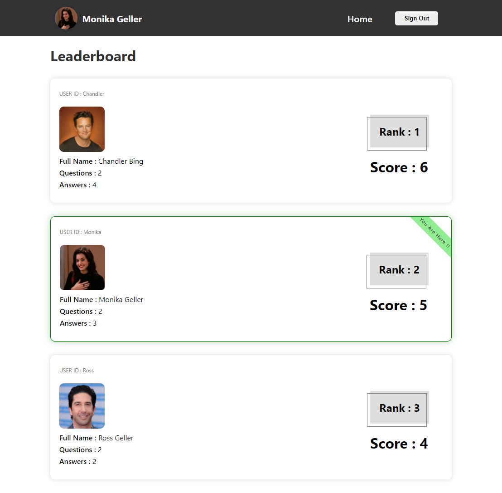

# Udacity Project

## Would You Rather Game - Redux App

**Insallation User `npm install` to create node_modules folder**

1 - `npm start` Is the command to start the Dev-server.
> It will direct you to the login page where you select a user from the users provided in the _DATA.js 

---

SCREENS

---

## Home Page
> Where You'd find the Unanswered Questions by default and a button to switch to the Answered Questions 

## Select a Poll
> From the home page you can see any poll where you will be directed to the poll's information if it's Unanswered You can vote and be redirected to the Home page to see other Unvoted polls

Or if it's answered 

## Leaderboard Page
> Where you'd find your ranking and score amongst other Users and Information about them and their scores

## Add a Poll 
> Where you would be presented with Two inputs to enter your questions and a button to create a new Poll of these questions

